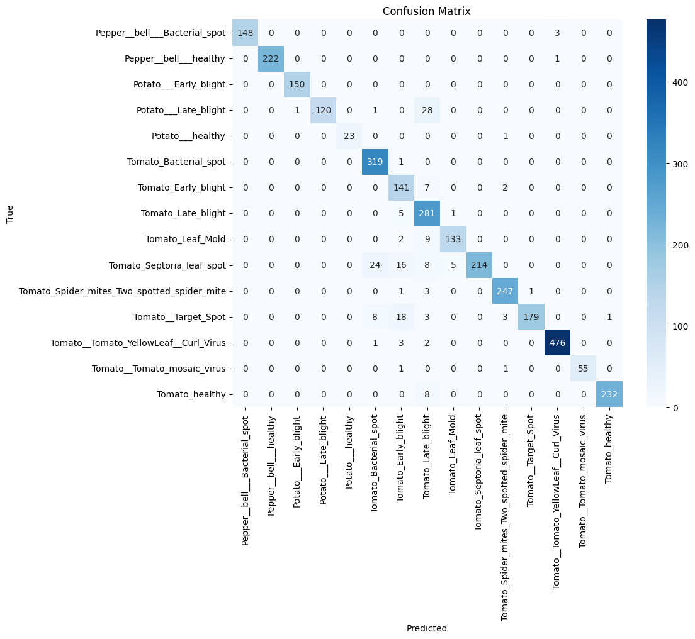

# PlantVillage ResNet18 Demo

This project is a web-based demo for plant disease classification using a ResNet18 model and the [PlantVillage](https://www.kaggle.com/datasets/emmarex/plantdisease/data) dataset on kaggle. 

The project consisted of a full development cycle, from developing, training and validating the model, to uploading to MLFlow for MLOps, to uploading model on Render for production use. 

Users can upload images of plant leaves, and the model returns predictions of the most probable diseases.

### Try it live! 
[PlantVillage ResNet18 Classifier on Render](https://plantvillage-resnet18.onrender.com)  
*(Note: using free Render service, may take ~30s to wake up after first request)*

## Model

- Dataset: [PlantVillage](https://www.kaggle.com/datasets/emmarex/plantdisease/data)
- Preprocessing: train/val/test split 70,15,15 with augmentations; resize (256x256 -> 128x128), crop, rotation, horizontal flip, normalization with ImageNet mean and std

- Model architecture:
  - Base model: ResNet18
  - No pretrained weights, trained from scratch in Colab
  - Final dense layer replaced with 15 outputs (default for ResNet18 is 100)
  
- Training:
  - Loss: CrossEntropy
  - Optimizer: SGD (lr=0.01, momentum=0.9)
  - Batch size: 32, epochs 5

- Results:
  - Test accuracy: 94.56%
  - Macro F1: 94.6%
  - Confusion Matrix:
  

## Deployment

Inference API built using FastAPI.

- Endpoints: 
  -  `POST /predict`: Accepts an image, runs it through the model and makes prediction, returns (by default) 3 top predictions with probabilities.
  -  `GET /health`: Simple GET call for testing.

- Static UI: Minimal `index.html` page with upload image and predict button.

- Hosting: Deployed to Render Web Services.
  - Start command: `uvicorn app.main:app --host 0.0.0.0 --port $PORT`

## Project Structure

- `app/main.py`: FastAPI application and API endpoints.
- `app/inference.py`: Model loading and prediction logic.
- `app/plantvillage.pt`: Pre-trained ResNet18 model weights.
- `app/labels.json`: Class labels for predictions.
- `static/index.html`: Simple web frontend for image upload and prediction display.

## Tech Stack

- **PyTorch**; training and inference
- **Torchvision**; ResNet18 architecture, training transforms
- **MLFlow**; experiment and metrics tracking, uploading models
- **FastAPI**; inference service calls
- **Render**; production, deployment, hosting
